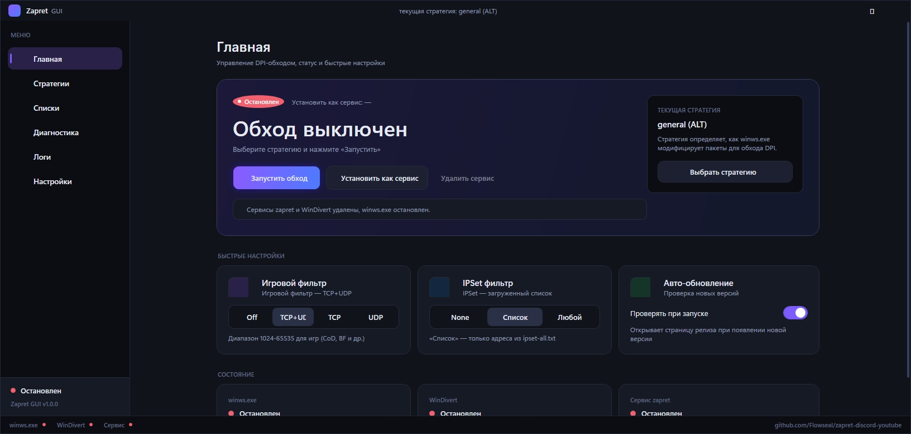
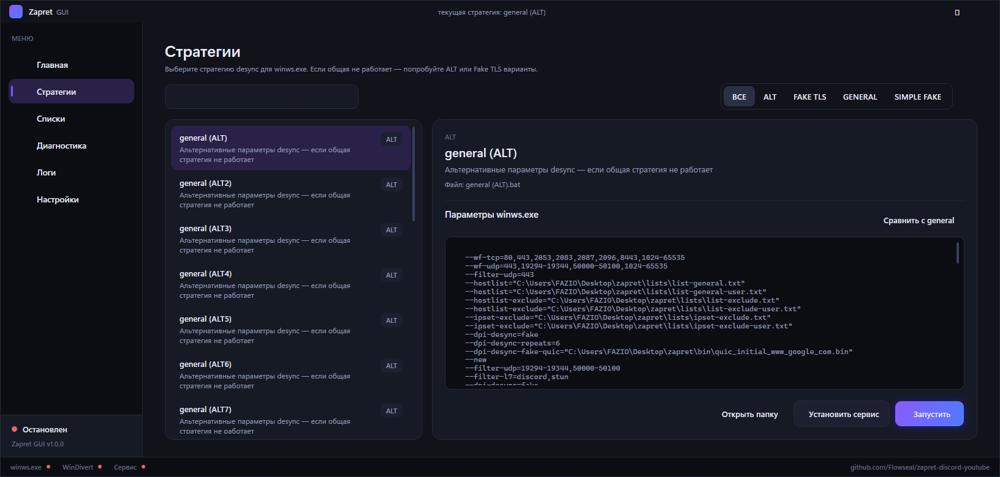
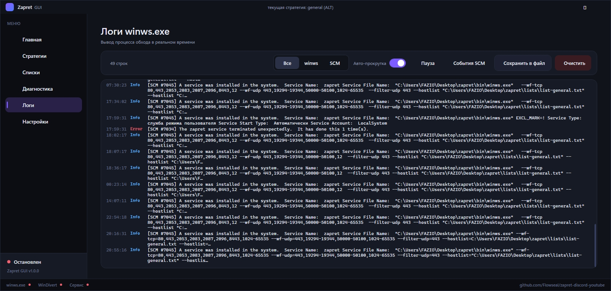

# Zapret GUI

[](https://github.com/SEMI-FAZIO/ZapretGUI/actions/workflows/build.yml)
[](LICENSE)

A modern Windows GUI for the [`zapret-discord-youtube`](https://github.com/Flowseal/zapret-discord-youtube) DPI bypass by Flowseal. Built with .NET 8 / WPF, single-file `.exe`, dark and light themes, RU and EN locales.

[Read in Russian](#русская-версия)

---

## Screenshots

| Dashboard | Strategies | Logs |
| --- | --- | --- |
|  |  |  |

## What it does

ZapretGUI is **not** the bypass itself — it is a frontend over the original `zapret-discord-youtube` package (`winws.exe`, `WinDivert`, strategy `.bat` files, `ipset` / `hosts` lists). Drop the GUI next to a working install and it manages:

- **Bypass control** — start/stop `winws.exe` or install it as a Windows service, both honoring the exact same parameters the original `.bat` files use.
- **Strategy picker** — auto-discovers every `*.bat` next to the GUI that invokes `winws.exe`, groups them by family (`GENERAL` / `ALT` / `FAKE TLS` / `SIMPLE FAKE`), shows the final `winws.exe` command line.
- **Game / IPSet / Auto-update toggles** — write the same `utils\game_filter.enabled`, `lists\ipset-all.txt`, `utils\check_updates.enabled` files as `service.bat`.
- **User domain lists** — edit `list-general-user.txt`, `list-exclude-user.txt`, `ipset-exclude-user.txt` from the UI.
- **`ipset-all` and `hosts` updates** — pulls the latest copies from Flowseal/zapret-discord-youtube.
- **System diagnostics** — every check from `service.bat :service_diagnostics` (BFE, TCP timestamps, Adguard, Killer, Check Point, GoodbyeDPI, VPN, DoH, hosts conflicts) plus a connection probe to discord.com, youtube.com, google.com, github.com.
- **Live winws.exe logs** — optional stdout capture into a tail-style viewer with save/clear/pause/auto-scroll.
- **First-run installer** — if `zapret` is not next to the GUI, the wizard downloads the latest release from GitHub and unpacks it next to itself.

Everything writes the same files that `service.bat` does — you can mix and match the GUI and the original scripts in the same install.

## Install

1. Download `ZapretGUI.exe` from [Releases](https://github.com/SEMI-FAZIO/ZapretGUI/releases/latest).
2. Drop it into your `zapret` folder (the one with `bin\winws.exe`). If you don't have a zapret install yet, place the exe in any folder and the first-run wizard will download `zapret-discord-youtube` from Flowseal's repo into the same folder.
3. Run `ZapretGUI.exe`. The bypass needs admin rights to install services and capture packets, so the manifest requests UAC.

> [!NOTE]
> The build is framework-dependent — it needs the **.NET 8 Desktop Runtime (x64)**. Get it from [microsoft.com/dotnet](https://dotnet.microsoft.com/download/dotnet/8.0). Most modern Windows installs already have it.

## Features

- **Native Windows 11 look** — custom dark and light palettes, Segoe Fluent Icons, custom titlebar, animated toggles.
- **Russian and English** — switch on the fly from Settings.
- **First-run wizard** — detects a missing bypass and offers to download from GitHub.
- **Real-time logs** — stdout from `winws.exe` is streamed into a Logs tab, with pause / auto-scroll / save-to-file.
- **Connection probe** — measures HTTPS HEAD latency + ICMP ping + heuristic score for Discord / YouTube / Google / GitHub.
- **Autostart with Windows** — toggle in Settings registers the GUI in `HKCU\Run`; optionally start minimized and auto-launch the bypass.
- **Compatible** — every toggle writes the same files as `service.bat`. You can keep using `general.bat` directly whenever you want.
- **Dual-mode strategy source** — auto-detects ZDefree distributions (`manifest.json` present) and switches to native JSON strategies via [`ZDefree.Core`](https://github.com/SEMI-FAZIO/ZDefree-tools). Otherwise falls back to legacy Flowseal `.bat` parsing. A mode chip in the titlebar shows which engine is active. See [ZDefree](https://github.com/SEMI-FAZIO/ZDefree) for the spec.
- **Auto-pick best strategy** (ZDefree mode) — detects your ISP via `ipinfo.io`, matches against each strategy's `compat.tested_isps`, and selects the highest-ranked candidate.
- **Hot-reload** (ZDefree mode) — edit any `strategies/*.json` on disk and the GUI re-reads the catalog automatically (debounced).
- **ISP fingerprint** in Settings — shows your detected IP, country, ASN, ISP, and a `CompatTag` string ready to paste into `strategies/<file>.json#/compat/tested_isps`.

## Build from source

Requirements: Windows 10+, .NET 8 SDK or newer.

```pwsh
git clone https://github.com/SEMI-FAZIO/ZapretGUI.git
git clone https://github.com/SEMI-FAZIO/ZDefree-tools.git  # sibling — provides ZDefree.Core for native JSON mode
cd ZapretGUI
dotnet publish src/ZapretGUI/ZapretGUI.csproj -c Release -r win-x64 --self-contained false -p:PublishSingleFile=true -o publish
```

The output is `publish/ZapretGUI.exe` (~70 MB single-file, framework-dependent).

For a fully portable exe (~150 MB, no .NET runtime needed) replace `--self-contained false` with `--self-contained true`.

> Note: the build expects `ZDefree-tools/` to be checked out next to `ZapretGUI/` so the `<ProjectReference>` to `ZDefree.Core` resolves. CI does this automatically.

## Credits

- [`zapret-discord-youtube`](https://github.com/Flowseal/zapret-discord-youtube) by **Flowseal** — the actual bypass: strategies, lists, helper scripts.
- [`zapret`](https://github.com/bol-van/zapret) by **ValdikSS / bol-van** — the underlying DPI desync engine and `winws.exe`.
- [`WinDivert`](https://github.com/basil00/Divert) by **Basil00** — the packet capture driver.
- [`ZDefree`](https://github.com/SEMI-FAZIO/ZDefree) + [`ZDefree-tools`](https://github.com/SEMI-FAZIO/ZDefree-tools) — the JSON-based distribution + .NET tooling powering native mode, auto-pick, ISP detection, and hot-reload.

This project is licensed under the [MIT License](LICENSE). The bundled bypass binaries are owned by their respective authors and distributed under their own licenses.

## Donate

If the project helps you and you'd like to throw a coin — thank you!

| ETH | BTC | BNB Smart Chain |
| :---: | :---: | :---: |
|  |  |  |
| `0x18DF4c87e77647276B63dE9E10AFdf8e51455Af9` | `bc1qln4ty9jhlt42qheywun5z8vlhhd9yplwzxjgaw` | `0x18DF4c87e77647276B63dE9E10AFdf8e51455Af9` |

---

## Русская версия

Современный Windows-интерфейс для [`zapret-discord-youtube`](https://github.com/Flowseal/zapret-discord-youtube) от Flowseal. .NET 8 / WPF, single-file `.exe`, тёмная и светлая темы, русский и английский.

### Что это

ZapretGUI **не сам обход**, а оболочка над оригинальным `zapret-discord-youtube` (winws.exe, WinDivert, стратегии `.bat`, списки ipset и hosts). Положи GUI рядом с рабочей установкой — и он управляет всем тем же, чем штатные `.bat`:

- Запуск/остановка `winws.exe` или установка его как Windows-сервис с **теми же параметрами**, что и в `.bat`.
- Авто-обнаружение всех стратегий `.bat`, группировка по семействам (GENERAL / ALT / FAKE TLS / SIMPLE FAKE), preview итоговой командной строки `winws.exe`.
- Переключение игрового фильтра, IPSet, авто-обновлений — пишет в те же `utils\game_filter.enabled`, `lists\ipset-all.txt`, `utils\check_updates.enabled`.
- Редактирование пользовательских списков (`list-general-user.txt`, `list-exclude-user.txt`, `ipset-exclude-user.txt`).
- Обновление `ipset-all` и `hosts` напрямую из репозитория Flowseal.
- Полная диагностика (Base Filtering Engine, TCP timestamps, Adguard, Killer, Check Point, GoodbyeDPI, VPN, DoH, конфликты в hosts) + проверка соединения с Discord / YouTube / Google / GitHub.
- Лайв-логи winws.exe (опционально), пауза, авто-прокрутка, сохранение в файл.
- При первом запуске, если обход не найден рядом, мастер предлагает скачать последний релиз с GitHub.

### Установка

1. Скачай `ZapretGUI.exe` из [Releases](https://github.com/SEMI-FAZIO/ZapretGUI/releases/latest).
2. Положи рядом с папкой `zapret` (где `bin\winws.exe`). Нет установки — клади в любую папку, мастер при первом запуске сам скачает.
3. Запусти. Обход требует прав администратора — manifest сразу запрашивает UAC.

Нужен **.NET 8 Desktop Runtime (x64)** — почти всегда уже стоит на свежей Windows.

### Сборка из исходников

```pwsh
git clone https://github.com/SEMI-FAZIO/ZapretGUI.git
cd ZapretGUI
dotnet publish src/ZapretGUI/ZapretGUI.csproj -c Release -r win-x64 --self-contained false -p:PublishSingleFile=true -o publish
```

### Благодарности

- [`zapret-discord-youtube`](https://github.com/Flowseal/zapret-discord-youtube) — **Flowseal**, оригинальные стратегии и скрипты.
- [`zapret`](https://github.com/bol-van/zapret) — **ValdikSS / bol-van**, движок DPI-обхода и `winws.exe`.
- [`WinDivert`](https://github.com/basil00/Divert) — **Basil00**, драйвер перехвата пакетов.

Лицензия GUI — [MIT](LICENSE). Бинарники обхода распространяются под лицензиями их авторов.

### Поддержать проект

Кому не жалко монетку — спасибо!

| ETH | BTC | BNB Smart Chain |
| :---: | :---: | :---: |
|  |  |  |
| `0x18DF4c87e77647276B63dE9E10AFdf8e51455Af9` | `bc1qln4ty9jhlt42qheywun5z8vlhhd9yplwzxjgaw` | `0x18DF4c87e77647276B63dE9E10AFdf8e51455Af9` |


